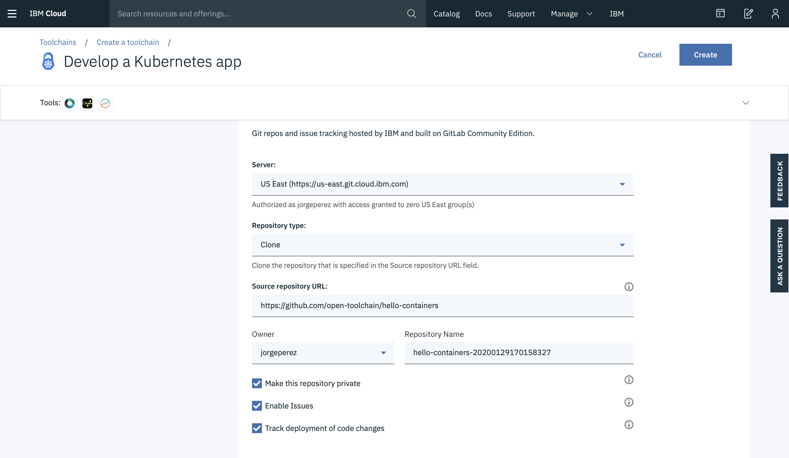
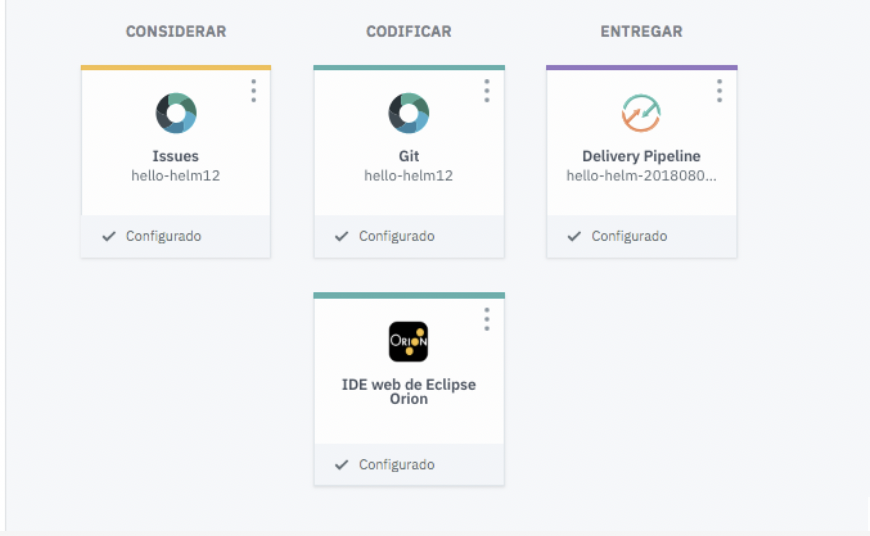
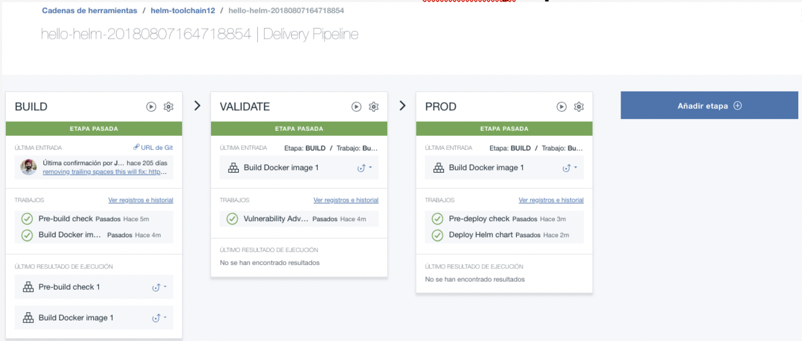
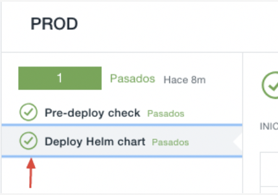
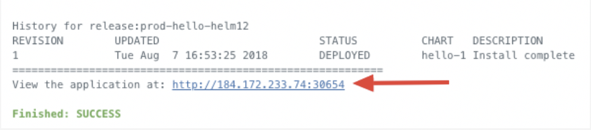

# IBM Continuous Delivery
Despliega una app en Continuous Delivery
 

## Antes de empezar te recomendamos:
* Realizar el [PreWork][url-prework].
* Si eres estudiante o profesor y tienes correo institucional te recomendamos los [Cupones][url-cupones].
* Si tienes algun codigo promocional te decimos como [Aplicarlos][url-aplica].

[url-prework]: https://github.com/ibmdevelopermx/Cloud-Apps-Serie#Prework
[url-cupones]: https://github.com/ibmdevelopermx/Cloud-Apps-Serie#Cupones-para-profesores-y-estudiantes
[url-aplica]: https://github.com/ibmdevelopermx/Cloud-Apps-Serie#Cargar-cr%C3%A9ditos-en-IBM-Cloud

# DevOps con Cloud Foundry
Ahora veremos como automatizar los procesos necesarios para el despliegue de la aplicación con la herramienta de IBM Cloud “Countinuos delivery”. Esto nos permitira tener nuestro repositorio con una aplicación hosteada en el entorno de Cloud Foundry, permitiendo recibir cambios y actualizarlos de manera inmediata.

1. Entramos al dashboard de [**IBM Cloud**](https://cloud.ibm.com/login). 
2. Entramos al apartado de CATALOG  
 

3. Buscamos el servicio de Continuous Delivery y creamos el servicio 
 

4. En la pantalla de inicio del servicio, nos vamos al apartado "Getting Started" y damos clic en el apartado "toolchain template"  
 

5. Usamos el template de Kubernetes con Helm 
 

6. Nos aseguramos que aparezcan los datos de esta manera (Se genera automáticamente) 
 

7. Damos clic en el apartado delivery pipeline y creamos una API Key con el botón "New" 
 

## Considerar lo siguiente 
•	EL nombre de registro de contenedor debe ser un espacio que ya exista 
•	Usaremos el cluster que creamos anteriormente llenando el apartado de "cluster name" 
•	Si el namespace no existe dentro del cluster este sera creado automáticamente. 
•	Si el espacio “prod” no existe dentro del cluster este sera creado. 

Una vez que le demos crear podremos vizualisar nuestras herramientas. Entre ellas nuestro Delivery Pipeline que se encargara de crear los procesos que automatizaremos 
 

7. Entramos a nuestra herramienta “Delivery Pipeline” 
 

Como podemos observar, cuando creamos la cadena de herramientas, esta automaticamente genero los procesos necesarios para realizar el despliegue. Entre los que se encuentran el “Build” donde se revisa la dockerizacion de nuestra aplicación.
Validate en donde se utiliza el servicio de “Vulnerability advisor” el cual revisara nuestras vulnerabilidades.
Y por ultimo el despliegue de la aplicación en un POD 

8. En la etapa de Producción, debajo de los registros del despliegue podremos ver la url de nuestra aplicación desplegada. 

 

 

Si entramos a esta url podremos ver nuestra aplicación corriendo con un simple “Welcome to Bluemix DevOps with Docker, Kubernetes and Helm Charts. Lets go use the Continuous Delivery Service”
