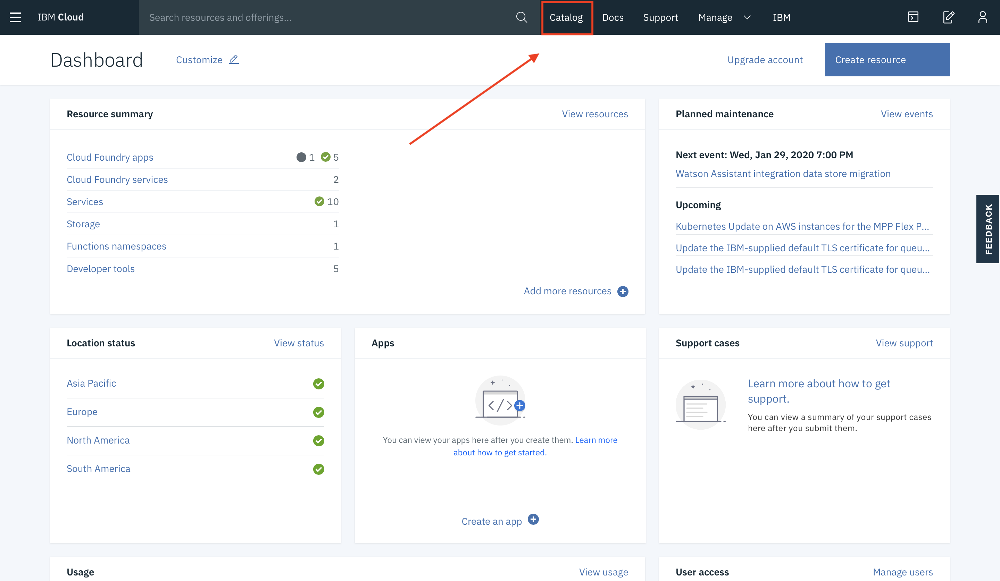
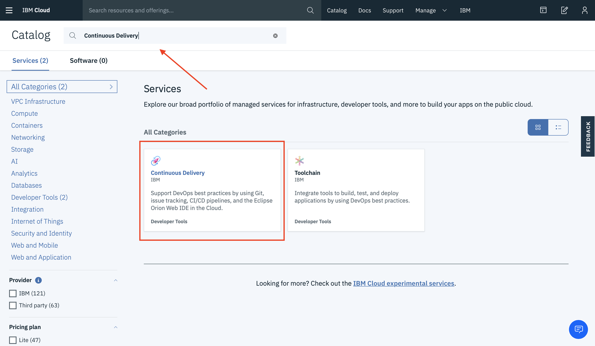
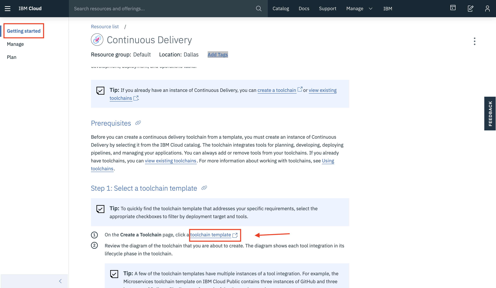
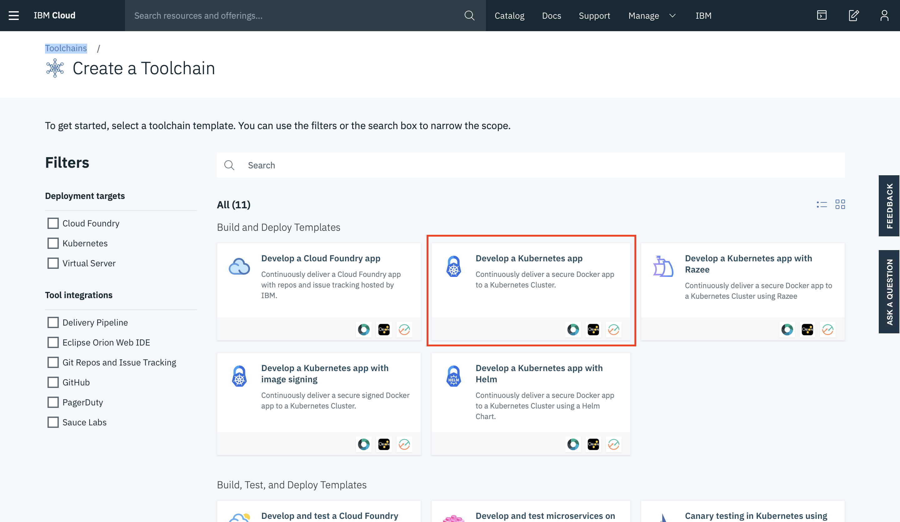
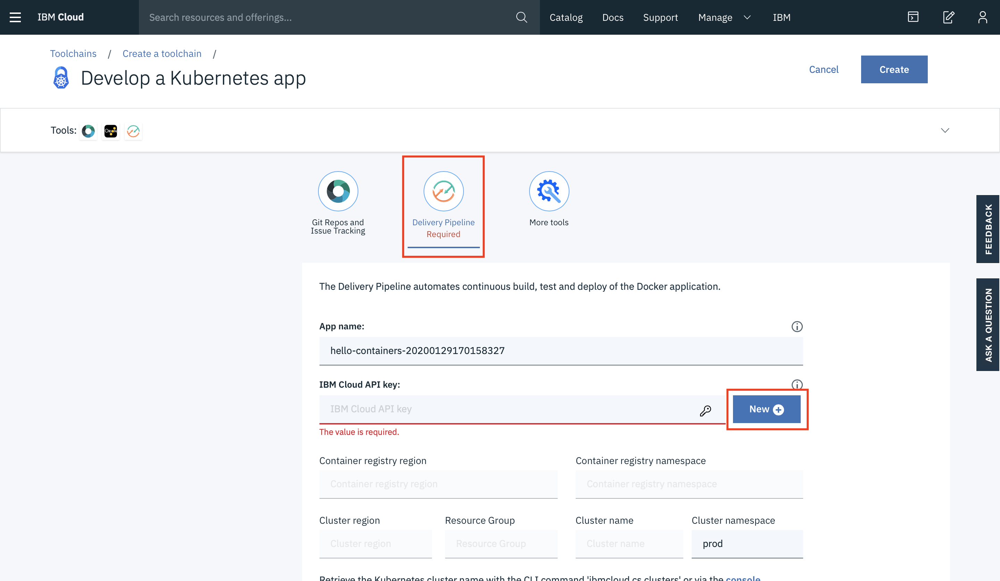

# IBM Recipe-Continuous Delivery
Despliega una app en Continuous Delivery utilizando DevOps con Kubernetes y Helm
 
# Pre-requisitos
•	Tener una cuenta de [**IBM Cloud**](https://cloud.ibm.com/login). 
• Instalar la CLI de [**IBM Cloud**](https://console.bluemix.net/docs/cli/reference/bluemix_cli/get_started)  
•	Instalar plugins: Container registry y container service
###
    ibmcloud plugin install container-registry -r Bluemix
    ibmcloud plugin install container-service -r Bluemix

# Cupones para Estudiantes y profesores
1.	Acceder al [**HUB para Software para uso académico**](https://onthehub.com/ibm/?utm_sourc=ibm-ai-productpage&utm_medium=onthehubproductpage&utm_campaign=IBM). Y navegar hasta la parte de abajo de la pagina  
2.	Buscar el WebStore del instituto/escuela al que perteneces. 
3.	En caso de no contar con WebStore, acceder al portal de [**IBM Academic Initiative**](https://my15.digitalexperience.ibm.com/b73a5759-c6a6-4033-ab6b-d9d4f9a6d65b/dxsites/151914d1-03d2-48fe-97d9-d21166848e65/home/), registrarse o iniciar sesión y seleccionar la opción de Students 
4.	Seleccionar Add to Cart para IBM Bluemix – 6 Month Trial. 
5.	Realizar el registro correspondiente utilizando la cuenta de correo académica 

# Cargar créditos en IBM Cloud (Se necesita para acceder a Kubernetes en IBM Cloud)
1.	Ingresamos a nuestro panel de control de IBM Cloud (console.bluemix.net)
2.	Una vez que tengamos el código nos vamos a Gestionar>Facturación y Uso>Facturación
3.	Buscamos “Códigos de características (Promocionales)”

## Crear un cluster
En caso de no tener instalado el plugin container-service, corer el siguiente commando:
###
    ibmcloud plugin install container-service -r Bluemix
Para crear un cluster realizamos el siguiente comando:
###
    ibmcloud cs cluster-create --name <name-of-cluster>
Hacemos login a IBM Cloud:
###
    ibmcloud login 
Corremos el siguiente comando para ver si nuestro cluster esta en un estado “Normal”
###
    ibmcloud cs clusters
Corremos el siguiente comando para ver que nuestros workers estén en un estado “normal” con un estatus “ready”
###
    ibmcloud cs workers <yourclustername>
 
Tomamos nota de nuestra IP Pública (En mi caso 184.172.234.189)
## Configuración de kubectl
En nuestra línea de comandos corremos el siguiente comando:
###
    ibmcloud cs cluster-config <yourclustername>
Debería regresar una línea semejante a la siguiente:
###
    SET KUBECONFIG=C:\Users\Your_user\.bluemix\plugins\container-service\clusters\Track10\kube-config-hou02-Track10.yml
Corremos esta línea, estamos dirigiendo nuestra variable de ambiente hacia el archivo que bajó de nuestra configuración del cluster. Nota: recordar que para usar kubectl siempre tenemos que correr estos dos comandos

Para verificar que kubectl está bien configurado: 
•	Corremos <i>kubectl cluster-info</i> esto debería regresarnos a que dirección IP está apuntando nuestro kubernetes master 
•	Corremos <i>kubectl cluster-info dump</i> este comando debería regresarnos un dump de toda la información de nuestro cluster

## Troubleshooting
En caso de que alguno de estos dos comandos no funcione debemos reconfigurar el kubectl con los siguientes pasos:
###
    ibmcloud logout
    ibmcloud login
    ibmcloud cs region-set us-south
    ibmcloud cs cluster-config <yourclustername>
    Ejecutamos la línea que regresa el último comando (SET KUBECONFIG=C:…..)
    kubectl cluster-info
    kubectl cluster-info dump
Una vez que kubectl cluster info-dump contesta tenemos configurado correctamente kubectl, si en cualquier momento el comando nos regresa un error concerniente a que nuestro request no obtuvo respuesta volvemos a realizar los pasos del troubleshooting.

# DevOps con Kubernetes y Helm
Ahora veremos como automatizar los procesos necesarios para el despliegue de la aplicación con la herramienta de IBM Cloud “Countinuos delivery”. Esto nos permitira tener nuestro repositorio con una aplicación empaquetadacon Helm. HELM es el manejador de paquetes de Kubernetes que nos ayudara a usar preconfiguraciones para los propositos de automatizar. Ademas este servicio agrega una herramienta especial que revisa las vulenaribilidades de nuestro contenedor.

1. Entramos al dashboard de [**IBM Cloud**](https://cloud.ibm.com/login). 
2. Entramos al apartado de CATALOG  
 

3. Buscamos el servicio de Continuous Delivery y creamos el servicio 
 

4. En la pantalla de inicio del servicio, nos vamos al apartado "Getting Started" y damos clic en el apartado "toolchain template"  
 

5. Usamos el template de Kubernetes con Helm 
 

6. Nos aseguramos que aparezcan los datos de esta manera (Se genera automáticamente) 
 

7. Damos clic en el apartado delivery pipeline y creamos una API Key con el botón "New" 
 

## Considerar lo siguiente 
•	EL nombre de registro de contenedor debe ser un espacio que ya exista 
•	Usaremos el cluster que creamos anteriormente llenando el apartado de "cluster name" 
•	Si el namespace no existe dentro del cluster este sera creado automáticamente. 
•	Si el espacio “prod” no existe dentro del cluster este sera creado. 

Una vez que le demos crear podremos vizualisar nuestras herramientas. Entre ellas nuestro Delivery Pipeline que se encargara de crear los procesos que automatizaremos 
 

7. Entramos a nuestra herramienta “Delivery Pipeline” 
 

Como podemos observar, cuando creamos la cadena de herramientas, esta automaticamente genero los procesos necesarios para realizar el despliegue. Entre los que se encuentran el “Build” donde se revisa la dockerizacion de nuestra aplicación.
Validate en donde se utiliza el servicio de “Vulnerability advisor” el cual revisara nuestras vulnerabilidades.
Y por ultimo el despliegue de la aplicación en un POD 

8. En la etapa de Producción, debajo de los registros del despliegue podremos ver la url de nuestra aplicación desplegada. 

 

 

Si entramos a esta url podremos ver nuestra aplicación corriendo con un simple “Welcome to Bluemix DevOps with Docker, Kubernetes and Helm Charts. Lets go use the Continuous Delivery Service”
