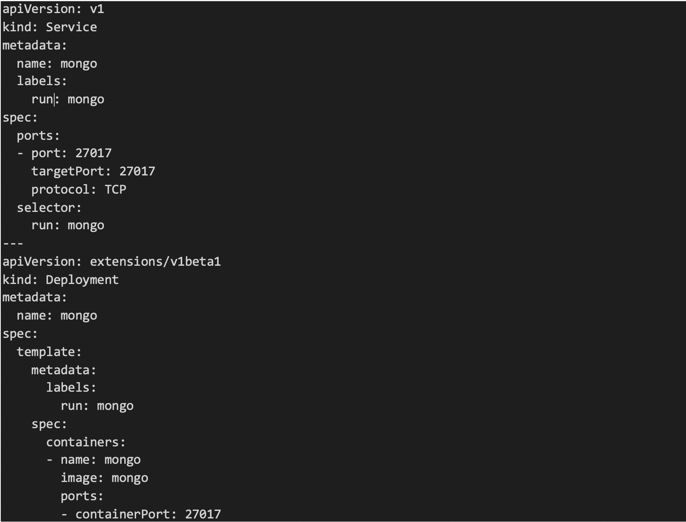
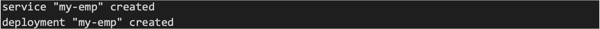
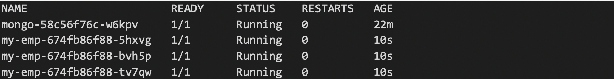
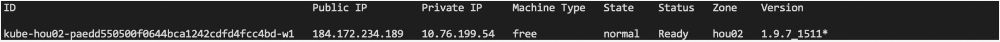

# IBM Recipe - Kubernetes
 

Aprende a crear un Docker con una app en Node.js que escribe datos en una Database en Mongo DB y despliegalo en 2 diferentes pods en Kubernetes!
# Pre-requisitos
•	Tener instalado [**Node.js**](https://nodejs.org/es/). 
•	Tener una cuenta de [**IBM Cloud**](https://cloud.ibm.com/login). 
•	Instalar [**Docker**](https://www.docker.com/get-started) 
• Instalar la CLI de [**IBM Cloud**](https://console.bluemix.net/docs/cli/reference/bluemix_cli/get_started)  
•	Instalar plugins: Container registry y container service
###
    ibmcloud plugin install container-registry -r Bluemix
    ibmcloud plugin install container-service -r Bluemix

# Cupones para Estudiantes y profesores
1.	Acceder al [**HUB para Software para uso académico**](https://onthehub.com/ibm/?utm_sourc=ibm-ai-productpage&utm_medium=onthehubproductpage&utm_campaign=IBM). Y navegar hasta la parte de abajo de la pagina  
2.	Buscar el WebStore del instituto/escuela al que perteneces. 
3.	En caso de no contar con WebStore, acceder al portal de [**IBM Academic Initiative**](https://my15.digitalexperience.ibm.com/b73a5759-c6a6-4033-ab6b-d9d4f9a6d65b/dxsites/151914d1-03d2-48fe-97d9-d21166848e65/home/), registrarse o iniciar sesión y seleccionar la opción de Students 
4.	Seleccionar Add to Cart para IBM Bluemix – 6 Month Trial. 
5.	Realizar el registro correspondiente utilizando la cuenta de correo académica 

# Cargar créditos en IBM Cloud (Se necesita para acceder a Kubernetes en IBM Cloud)
1.	Ingresamos a nuestro panel de control de IBM Cloud (console.bluemix.net)
2.	Una vez que tengamos el código nos vamos a Gestionar>Facturación y Uso>Facturación
3.	Buscamos “Códigos de características (Promocionales)”

# Dockerizar y push a Container Registry
1. Accedemos a la terminal de nuestra PC (Asegúrate de tener instalado el CLI de IBM Cloud)
2. Realizamos login a IBM Cloud
###
    ibmcloud login
3.	Ponemos nuestro mail y contraseña y seleccionamos la región sur de EEUU
4.	Realizamos login de nuestro dominio de Docker local a IBM Cloud
###
    ibmcloud cr login 
5.	Nos loggeamos en Cloud Foundry. Para hacer un login desde la línea de comandos a Cloud Foundry debemos ingresar el comando:
###    
    cf login
6.	Una vez ejecutado este comando la línea de comandos regresará un prompt similar a este en el cual debemos ingresar nuestra cuenta y usuario:

7.	Posteriormente nos pedirá que elijamos nuestra “org” y “space” (los defaults son nuestro userID de IBM y dev)
8.	Una vez terminado debería imprimir lo siguiente:

## Crear un Namespace
Para poder subir imágenes a nuestro IBM Cloud Container Registry primero necesitamos crear un namespace con el siguiente comando:
###
    ibmcloud cr namespace-add <my_namespace>
Nota: Cambiar el apartado de <my_namespace> por un nombre 
## Crear imagen de la app
1. Clonamos este repositorio
2. Dentro del directorio de la aplicación que bajamos o clonamos entramos a la carpeta Docker y abrimos un archivo llamado Dockerfile
3. En este archivo nos aseguramos que esten escritos los siguientes campos:
###
    FROM node:latest
    RUN mkdir -p /usr/src/app
    WORKDIR /usr/src/app
    COPY package.json /usr/src/app/
    RUN npm install
    RUN npm i -s nodemon
    COPY . /usr/src/app
    EXPOSE 3000
    ENV PORT=3000
    ENV MONGO_SERVICE_HOST=mongo
    ENV MONGO_SERVICE_PORT=27017
    CMD [ "npm", "start" ]
4.	El puerto en el que configuramos el EXPOSE es el que utilizaremos para accesar a la app una vez que esté corriendo (tomar nota de que este mismo puerto es el que utilizaremos en la parte 2 del tutorial para hacer el deployment en k8s)
5.	De igual forma la variable de ambiente que estamos configurando ponemos el nombre de la imagen de la base de datos (ENV MONGO_SERVICE_HOST=mongo)
6.	También abrimos un archivo .dockerignore y nos aseguramos que esté con este contenido:
###
    node_modules
    npm-debug.log
Esto es para que al hacer la imagen no incluya la carpeta node_modules dado que al correr npm install los instalará
7.	Posteriormente creamos la imagen Docker, utilizamos el tag (-t) para la imagen:
###
    docker build --tag registry.ng.bluemix.net/<my_namespace>/my-emp .
Nota: recordar el punto despues del nombre de la imagen
Nota: Cambiar el apartado de <my_namespace> por el nombre asignado anteriormente
8.	Verificamos si la imagen fue creada:
###
     docker images
## Push a un container registry 
Ya que creamos nuestra imagen hacemos un push con nuestro tag:
###
    docker push registry.ng.bluemix.net/<namespace>/my-emp
Para poder acceder a la interfaz gráfica de nuestro registry lo necesitamos crear [**Aquí**](https://console.bluemix.net/containers-kubernetes/registry/private)

# Deployment en K8
Para este ejercicio utilizaremos una aplicación "Hello world!" Desarrollada en Node.JS no para subirla a IBM Cloud en una región.

1.  Clonar el repositorio en nuestro escritorio 
###
    git clone https://github.com/ibmdbgmx/bootcampMx-get-started-node.git
2.	Entrar a la carpeta que se descarga
###
    cd bootcampMx-get-started-node.git
3.	Una vez dentro del la carpeta bootcampMx-get-started-node descargar toda la paqueteria y dependencias que necesita la aplicación (Esta info la extraera el comando del archivo package.json)

## Crear un cluster
En caso de no tener instalado el plugin container-service, corer el siguiente commando:
###
    ibmcloud plugin install container-service -r Bluemix
Para crear un cluster realizamos el siguiente comando:
###
    ibmcloud cs cluster-create --name <name-of-cluster>
Hacemos login a IBM Cloud:
###
    ibmcloud login 
Corremos el siguiente comando para ver si nuestro cluster esta en un estado “Normal”
###
    ibmcloud cs clusters
Corremos el siguiente comando para ver que nuestros workers estén en un estado “normal” con un estatus “ready”
###
    ibmcloud cs workers <yourclustername>
 
Tomamos nota de nuestra IP Pública (En mi caso 184.172.234.189)
## Configuración de kubectl
En nuestra línea de comandos corremos el siguiente comando:
###
    ibmcloud cs cluster-config <yourclustername>
Debería regresar una línea semejante a la siguiente:
###
    SET KUBECONFIG=C:\Users\Your_user\.bluemix\plugins\container-service\clusters\Track10\kube-config-hou02-Track10.yml
Corremos esta línea, estamos dirigiendo nuestra variable de ambiente hacia el archivo que bajó de nuestra configuración del cluster. Nota: recordar que para usar kubectl siempre tenemos que correr estos dos comandos

Para verificar que kubectl está bien configurado: 
•	Corremos <i>kubectl cluster-info</i> esto debería regresarnos a que dirección IP está apuntando nuestro kubernetes master 
•	Corremos <i>kubectl cluster-info dump</i> este comando debería regresarnos un dump de toda la información de nuestro cluster

## Troubleshooting
En caso de que alguno de estos dos comandos no funcione debemos reconfigurar el kubectl con los siguientes pasos:
###
    ibmcloud logout
    ibmcloud login
    ibmcloud cs region-set us-south
    ibmcloud cs cluster-config <yourclustername>
    Ejecutamos la línea que regresa el último comando (SET KUBECONFIG=C:…..)
    kubectl cluster-info
    kubectl cluster-info dump
Una vez que kubectl cluster info-dump contesta tenemos configurado correctamente kubectl, si en cualquier momento el comando nos regresa un error concerniente a que nuestro request no obtuvo respuesta volvemos a realizar los pasos del troubleshooting.

# Creación del archivo de configuración yaml del servicio y deployment de mongo 
Para este punto debemos estar dentro de la carpeta del proyecto que bajamos de github. Para hacer la configuración de mongo utilizaremos una imagen que está disponible para nosotros en DockerHub. 
Crearemos un archivo de nombre mongo.yaml en este directorio con la siguiente información:
 

Tener cuidado con la identación, debe ser de dos espacios por cada identación. Recorramos los puntos importantes del archivo:
•	Primero estamos configurando el servicio con un nombre de mongo y estamos especificando que corra el deployment mongo.  
•	Especificamos el puerto del servicio (27017) que es con el cual nuestra aplicación NodeJs accederá a nuestro pod de mongo 
•	Despues estamos configurando el deployment de igual forma con un nombre de mongo  
•	En la imagen ponemos simplemente mongo, este bajará la imagen de mongo en Docker Hub y hara el deployment de la misma 
Una vez que tenemos el archivo ejecutamos el comando kubectl create -f mongo.yaml para que se creen tanto el servicio como el deployment. 

Ejecutamos posteriormente el comando kubectl get svc Deberíamos de tener un output como el siguiente:
 

Confirmamos que el pod está en ejecución con el siguiente comando: 
###
    kubectl get pods
Deberíamos tener un output como el siguiente:   
 

# Creación del archivo de configuración yaml del servicio y deployment de Node
En la carpeta de nuestra aplicación node creamos un archivo llamado employee.yaml. El cual llenamos con:
 

Veamos lo importante de este yaml: 
•	<i>containerPort</i> debe ser igual a el puerto en el cual expusimos nuestra aplicación Node 
•	En image va la dirección al repositorio en el cual hicimos el push de nuestra imagen en el container registry (en caso de no haber hecho el push usar <i>isaaccarrada/my-emp</i> para jalar la imagen de un repositorio en Docker Hub) 
•	En el servicio este puerto es el que vamos a exponer para que se pueda acceder a este pod desde afuera 

# Notas importantes para la aplicación
Para la aplicación utilizamos el siguiente Dockerfile:
 

En este dockerfile el EXPOSE es el puerto que utilizaremos para acceder a nuestra aplicación que es el mismo que irá en el deployment, la variable de ambiente MONGO_SERVICE_HOST debe tener el nombre de la imagen en el pod al que se comunicará la aplicación asi como el PORT es el que utilizamos en el mongo.yaml para hacer deploy de la imagen.

# Deployment de employee.yaml
Ejecutamos el comando: 
###
    kubectl create -f mongo.yaml 
y deberíamos obtener algo semejante:
 

Posteriormente para identificar que todo sucedió correctamente corremos lo siguiente:
###
    kubectl get pods
 

Aqui notamos que nuestro deployment está funcionando, para comprobar que nuestro servicio esta funcionando corremos: 
###
    kubectl get svc
 
Tomamos nota del puerto de my-emp (32353)

Una vez que sabemos que esta funcionando usamos: 
###
    bx cs workers <clusterName> 
Esto nos devolverá algo semejante a:
 
Tomamos nota de la dirección pública (En mi caso 184.172.234.189)
Accedemos a este servicio con la ip publica (184.172.234.189) y el puerto (32353) 
En mi caso sería 184.172.234.189:32353

