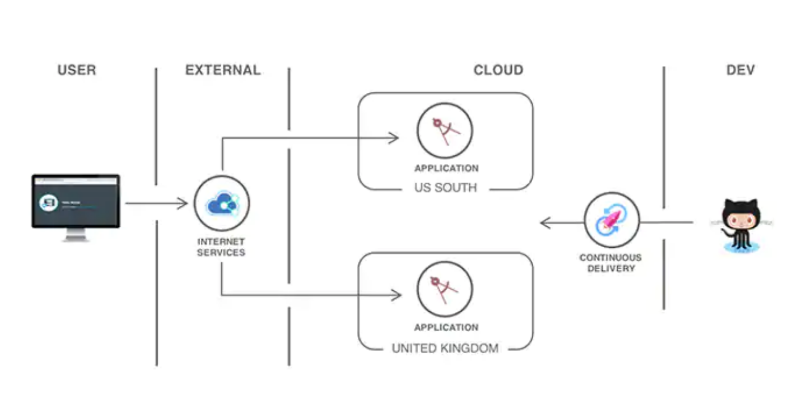
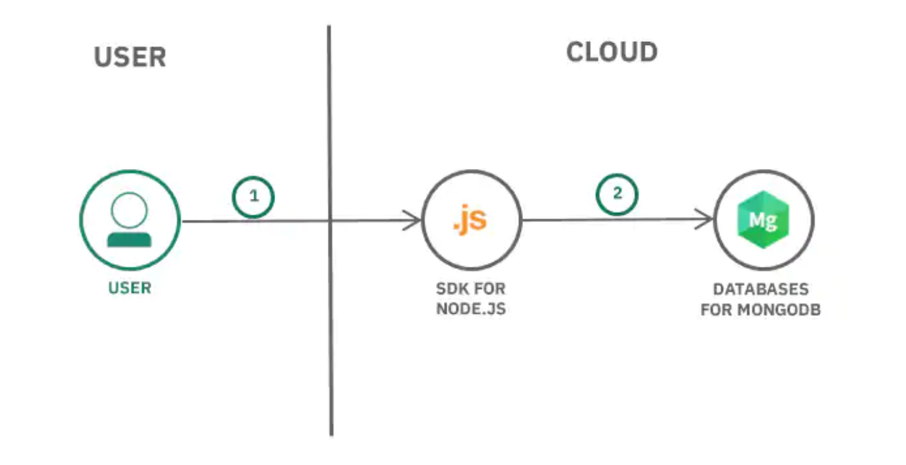
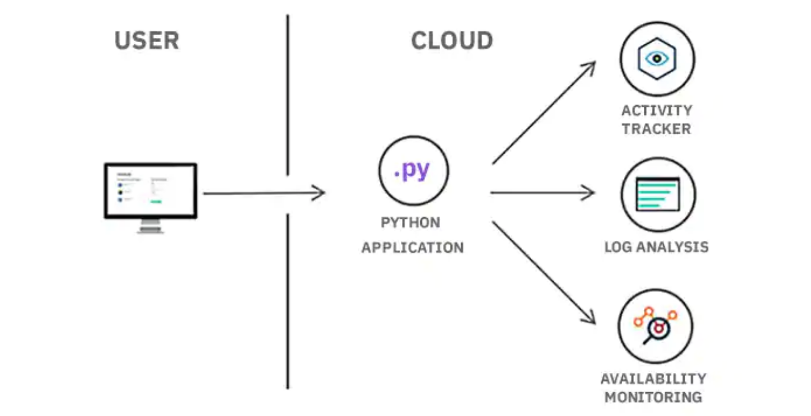
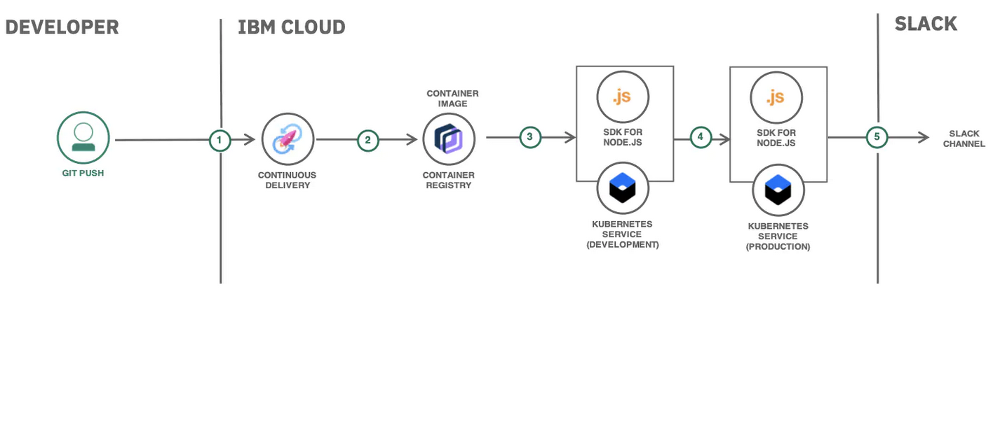

# Bootcamp-Cloud-Apps
En este bootcamp conoceras las herramientas de IBM Cloud, asosciadas con **Cloud Foundry**. Que te permitira desplegar y escalar apps sin configuraciones manuales y mantenimiendo servidores.

Estas herramientas las encontraras en [![IBM Cloud Powered][img-ibmcloud-powered]][url-ibmcloud] 
Podras encontrar más información en [![IBM Cloud Foundry][img-ibmcloudfoundry]][url-ibmcloudfoundry]

## ¿Qué es Cloud Foundry?
Cloud Foundry asegura que el desarrollo e implementación de la codificación sigan siendo cuidadosamente coordinados con cualquier servicio adjunto, lo que genera una rápida, consistente y confiable iteración de aplicaciones.

Puede implementar aplicaciones web de manera segura en varias regiones.

 
Puede tener una aplicacion que esta compuesta por un tiempo de ejecución de **Mongo DB**, con una infraestructura web express, front Angular y tiempo de ejecución NodeJS.

 
O puede tener una analisis de registros supervisar estados de una aplicación.

 

Puedes encontrar más información en el siguiente video: [![YouTube][img-youtube]][youtube-url]

## Conoceras que herramientas como:
1. ### Functions de IBM Cloud.  
Plataforma de IBM cloud de programacion poliglota FaaS (Functions-as-a-Service) para desarrollo de codigo ligero que escala dependiendo de la demanda.
* [![Functions][img-cloud-functions]][url-ibmcloud-Functions] Para obtener mayor información.
* [![Functions][git-cloud-functions]][git-ibmcloud-Functions] Para crear una aplicación sencilla.
* [![Appid][img-appid]][appid-url] Para una aplicación integrada.

2. ### IBM Cloud Kubernetes Services.  
Obtenga escala y diversidad de cargas de trabajo, seguridad y conformidad de mejor calidad, e integración con servicios como Watson™ e IBM Blockchain.
* [![Kubernetes][img-cloud-kubernetes]][url-ibmcloud-kubernetes] Para obtener mayor información.
* [![Kubernetesgit][img-gitcloud-kubernetes]][url-gitibmcloud-kubernetes] Para crear uno.

3. ### IBM Continuous Delivery.  
Adopte DevOps de una manera preparada para la empresa. Cree cadenas de herramientas que den soporte a sus tareas de entrega de aplicaciones. Automatice compilaciones, pruebas, implementaciones y más.
 
Puede tener una implementación continua hacia Kubernetes.

 

* [![Continuous-Delivery][img-cloud-CD]][url-ibmcloud-CD] Para más información.
* [![Git-Continuous-Delivery][img-gitcloud-CD]][url-gitibmcloud-CD] Para crear uno.

[img-youtube]: https://img.shields.io/badge/IBM%20Cloud-YouTube-critical.svg
[youtube-url]: https://www.youtube.com/watch?time_continue=14&v=oUpqXxmr6oU&feature=emb_logo
[img-ibmcloud-powered]: https://img.shields.io/badge/IBM%20Cloud-Powered-blue.svg
[url-ibmcloud]: https://www.ibm.com/cloud/
[img-cloud-functions]: https://img.shields.io/badge/IBM%20cloud-Functions-blue.svg
[url-ibmcloud-Functions]: https://www.ibm.com/cloud/functions
[img-ibmcloudfoundry]: https://img.shields.io/badge/IBM-Cloud%20Foundry-blue.svg
[url-ibmcloudfoundry]: https://www.ibm.com/cloud/cloud-foundry
[git-cloud-functions]: https://img.shields.io/badge/GIT-Cloud%20Functions-blueviolet.svg
[git-ibmcloud-Functions]: /Serverless_Cloudant
[img-appid]: https://img.shields.io/badge/GIT-AppID%20Serverless-brightgreen.svg
[appid-url]: https://github.com/ibmdevelopermx/Events_And_Users_FollowUp_App
[img-cloud-kubernetes]: https://img.shields.io/badge/IBM%20Cloud-Kubernetes%20Services-blue.svg
[url-ibmcloud-kubernetes]: https://www.ibm.com/cloud/container-service/
[img-cloud-CD]: https://img.shields.io/badge/IBM-Continuous%20Dlivery-blue.svg
[url-ibmcloud-CD]: https://www.ibm.com/cloud/continuous-delivery
[img-gitcloud-CD]: https://img.shields.io/badge/GIT-IBM%20Cloud%20Continuous%20Delivery-blueviolet.svg
[url-gitibmcloud-CD]: /IBM_Recipe-Continuous_Delivery
[img-gitcloud-kubernetes]: https://img.shields.io/badge/GIT-IBM%20Cloud%20Kubernetes-blueviolet.svg
[url-gitibmcloud-kubernetes]: /IBM_Recipe-Kubernetes